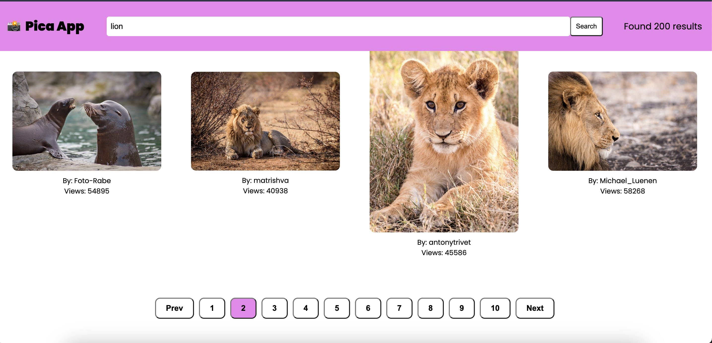
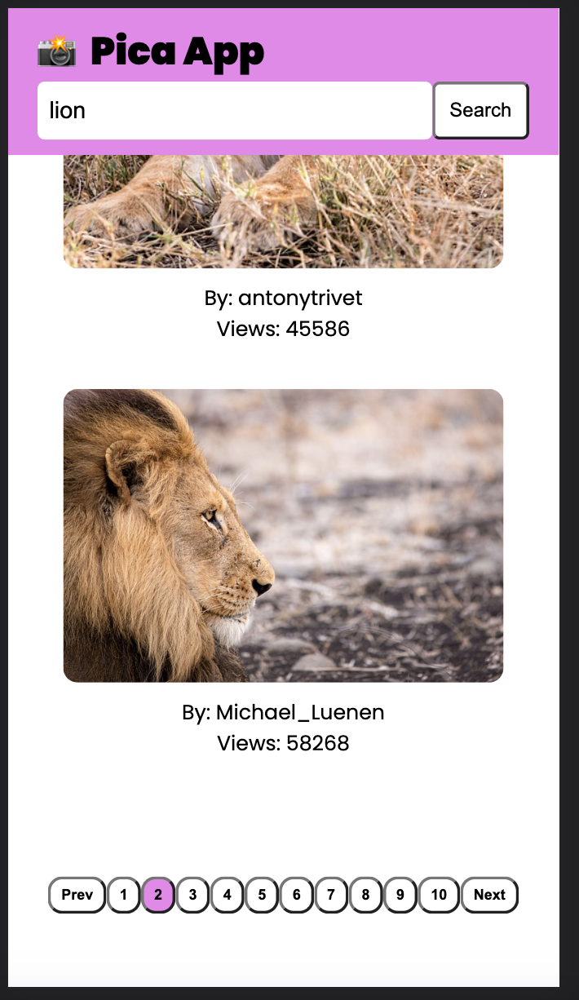

# Image Search and Browse Web Application

A web application built with React, Typescript and Vite that enables users to search for and browse images online.

## Features

- Search for images using keywords or phrases.
  - If results are found, pictures will be displayed;
  - if no results, a mesage will be displayed stating'No images. Please try another search term;
  - if there is any error, a message will be display stating 'Sorry. Something went wrong.'
- Browse through the search results and view images.
- Responsive design for optimal viewing on desktop and mobile devices.
- Pagination support to load more images.

## Screenshots

Desktop View:

Mobile View:

## Technologies Used

- React
- Vite
- HTML
- CSS
- JavaScript/TypeScript
- Vitest
- React Testing Library

## Getting Started

### Prerequisites

Vite requires Node.js version 14.18+, 16+. However, some templates require a higher Node.js version to work, please upgrade if your package manager warns about it.

### Commands

All commands are run from the root of the project, from a terminal:

| Command       | Action                                      |
| :------------ | :------------------------------------------ |
| `git clone`   | Clone repo                                  |
| `npm install` | Installs dependencies                       |
| `npm run dev` | Starts local dev server at `localhost:5173` |
| `npm test`    | Run tests                                   |

## API Usage

This web application uses the Pixabay API for fetching image data. You need to obtain an API key from Pixabay and set it in the `.env` file as follows:

`VITE_PIXABAY_API=YOUR_API_KEY`

For more information on the Pixabay API, visit [Pixabay API Documentation](https://pixabay.com/api/docs/).

## License

This project is licensed under the [MIT License](https://opensource.org/licenses/MIT).

## Acknowledgements

- [Pixabay](https://pixabay.com/) - Image search API provider.
